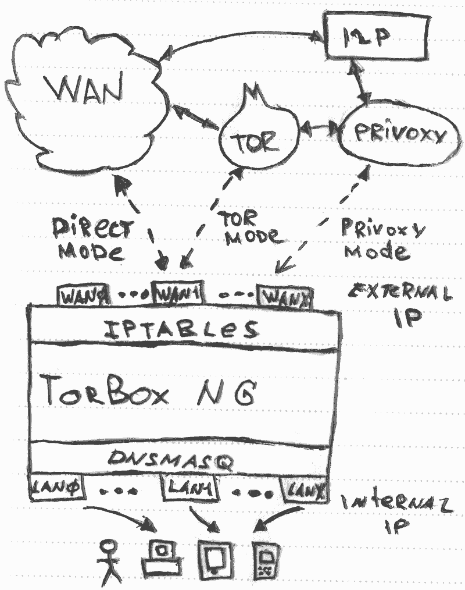
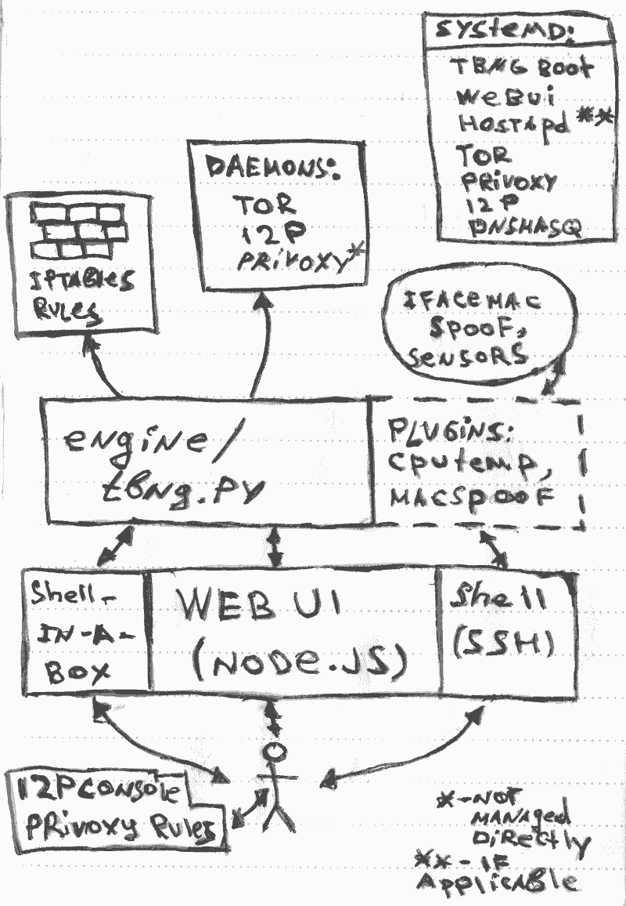

# TorBOX Next Generation

##### Общее описание

[[TOC]]

## Что это

TorBOX Next Generation (далее TBNG) — это набор сценариев для ОС Linux, используя который можно быстро и с небольшими усилиями  создавать защищенные точки доступа в Интернет.

Пользователь получает примерно такие возможности:

* "Прозрачно" использовать TOR.

* Получать доступ к [сети I2P](https://geti2p.net/ru/).

* Блокировать нежелательный трафик (баннеры).

* Работать как через проводной канал, так  и беспроводной (зависит от используемого оборудования).

* Управлять системой через web-интерфейс.

## Зачем это

TOR, он же The Onion Router — набор утилит для получения псевдоанонимного доступа в Интернет. Каждый пакет, отправляемый на какой-либо узел через TOR проходит по цепочке узлов, таким образом исходный адрес пакета для конечного узла скрыт.  Более подробно можно почитать об этом в [официальной документации проекта](https://www.torproject.org/about/overview.html.en). Задача TBNG — автоматизировать настройку и предоставить простой интерфейс, доступный практически с любого современного устройства — смартфона, планшета или компьютера. 

## Для кого это

### Требования к пользователю

Использование готовой настроенной системы максимально простое — подключиться к настроенной сети и выбрать желаемый режим работы через web-интерфейс. 

Первичная же настройка и установка потребует определенных навыков работы в Linux, таких как:

* Работа с командной строкой.

* Установка требуемых пакетов.

* Изменение конфигурации сетевых интерфейсов (через конфигурационный файл).

* Понимание основ работы TCP/IP в Linux.

* В некоторых случаях — готовность собрать модуль ядра для какой-нибудь очень экзотической сетевой карты (привет, realtek wifi!).

### Требования к "железу"

* Устройство, совместимое с Linux — обычный компьютер, арендованный VPS (KVM или лучше), одноплатный компьютер уровня Raspberry Pi.

* Два и более сетевых интерфейса. Один потребуется для подключения клиентов, второй для выхода в Интернет. Возможно использование виртуального интерфейса, такого как **tun/tap** при работе через VPN.

### Требования к ОС

#### Система

Linux, лучше Debian/Ubuntu. По крайней мере, протестировано именно на этих ОС.

#### Ключевые пакеты без которых точно ничего работать не будет

* systemd 

* Network Manager 

* sudo 

Последние два должны быть по крайней мере доступны в репозиториях для установки. 

#### Учетные записи

Для работы потребуется учетная запись без прав суперпользователя (non-root), в процессе же установки необходим root-доступ. То есть нужно либо знать пароль root, либо иметь возможность получать этот доступ через sudo.

В принципе, подойдет почти любой современный дистрибутив, кроме самых маргинальных. OpenWRT, Alpine Linux не поддерживаются и в ближайшее время не будут поддержаны.

## Как это работает

После успешной установки и первичной настройки целевое устройство превращается в точку доступа к сети Интернет, причем весь трафик клиентов перенаправляется через сеть [TOR](https://torproject.org/). Дополнительно можно настроить режим фильтрации трафика — удаление рекламы, кнопок Like и прочего (посредством пакета [Privoxy](https://www.privoxy.org/)). Также есть возможность пользоваться сервисом [I2P](http://geti2p.com). Подробная настройка есть в руководстве пользователя.

#### Схема работы проекта

Клиентские устройства подключаются к интерфейсам **_lan0...lanX_** — они могут быть как проводными, так и беспроводными. Адреса устройств назначаются с помощью пакета [dnsmasq](http://www.thekelleys.org.uk/dnsmasq/doc.html).

С помощью правил [iptables](https://www.netfilter.org/)  трафик направляется либо через связку TOR+Privoxy, либо TOR, либо напрямую. Для маршрутизации трафика используется технология [IP Masquerading](http://tldp.org/HOWTO/IP-Masquerade-HOWTO/ipmasq-background2.1.html) (также известный, как NAT).

#### Компоненты проекта TBNG

TBNG не использует бинарных файлов, все компоненты написаны на языке Python. В процессе установки необходимо установить некоторые пакеты (Python3, Tor, Privoxy, iptables и прочие). Часть из них может уже присутствовать в системе. Полный список компонентов доступен в руководстве по установке и настройке.

Ключевые компоненты проекта — на диаграмме.

Управление TBNG возможно как через web-интерфейс, так и через командную строку (ssh или веб-версия [shell-in-a-box](https://www.tecmint.com/shell-in-a-box-a-web-based-ssh-terminal-to-access-remote-linux-servers/)). 

