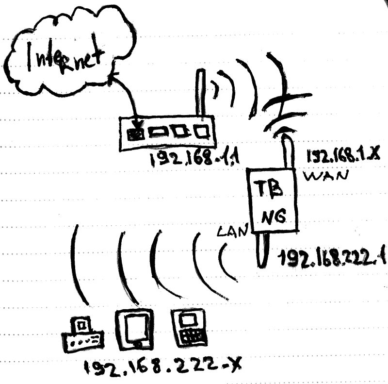

# TorBOX Next Generation

##### Руководство по Установке и Настройке

## Введение

Этот документ описывает шаги по установке и настройке набора скриптов TorBOX Next Generation (далее TBNG) — простому и удобному средству для создания точек доступа в сеть Интернет с использованием псевдо анонимной сети TOR (The Onion Router).

Предполагается, что пользователь:

* В достаточной мере ориентируется в ОС Linux — умеет устанавливать пакеты и редактировать конфигурационные файлы.

* Имеет представление о настройке сети в Linux.

* Ознакомлен с описанием проекта TBNG.

Так же предполагается, что ОС полностью работает, нет проблем с драйверами и имеется доступ в интернет.

TBNG не предоставляет "готовые сборки", "работающие образы", а также никто не будет решать проблемы с драйверами, кроме самого пользователя. Это инструмент, расширяющий возможности  обеспечения приватности и да, требуются некоторые усилия для его правильной настройки.

## Системные требования

* Операционная система Linux, работающая с SystemD (init.d, openrc не подходят).

* Доступность Network Manager (хотя бы в пакетах стандартного репозитария ОС, если не используется в данный момент). Версия должна быть не младше 0.9.10.0.

* Один сетевой интерфейс для доступа в Интернет (должен работать на момент установки).

* Один сетевой интерфейс (возможно, виртуальный типа TUN/TAP) для клиентского соединения. В идеале он уже должен быть настроен и работать.

*  Учетная запись без прав root (обычная учетная запись).

* Возможность получить права root (либо sudo, либо нужно знать пароль root).

Отличный вариант — ставить TBNG на свежеустановленную систему, где есть только стандартные пакеты.

TBNG протестирован на следующем оборудовании:

* Orange Pi PC 2, Armbian Ubuntu 16.04 unstable mainline kernel, Wifi 1 Realtek 8188EU, Wifi 2 Ralink 2800

* Orange Pi Zero, Armbian  Ubuntu 16.04 stable legacy kernel, Wifi 1 Internal WiFi, Wifi 2 Ralink 2800

* Cubieboard 2, Armbian Debian Jessie stable mainline kernel, Wifi RTL8192CU (concurrent mode)

* Raspberry Pi 1, Raspbian@Debian Stretch, Wifi 1 RTL8188EU, Wifi 2 Ralink 2800

* Разные платы под управлением Diet PI OS

* VPS x86-64, Ubuntu 16.04, Ethernet, VPN virtual interface

Объем памяти для комфортной работы — 512 MB + Swap. Одноядерный процессор от 600..800 Мгц тоже достаточен для работы. 

TBNG — это всего лишь скрипты. Основные потребители памяти — web-интерфейс и конечно же  I2P, который использует Java.

## Термины и определения

Для определенности введем некоторые термины.

Сеть во "внешний мир" — Интернет будем называть **WAN**.

Сеть, которую будет создавать TBNG для доступа клиентов будем называть **LAN**.

Предположим, что устройство (компьютер, одноплатный компьютер) соединено с роутером, и имеет доступ в Интернет. Пусть роутер имеет адрес 192.168.1.1, а целевое устройство для TBNG получило WAN-адрес 192.168.1.x. Это может быть как проводной интерфейс, так и беспроводной, главное получить доступ в Интернет. 

Адрес интерфейса LAN на стороне — 192.168.222.1, статический. 

Также предположим, что пользователь Linux называется *johndoe*, соответственно домашняя директория будет называться */home/johndoe*.

Мы будем настраивать TBNG с двумя беспроводными сетевыми интерфейсами, чтобы проиллюстрировать настройку точки доступа на TBNG. На рисунке ниже представлен примерный вариант работы:



## Установка файлов пакета TBNG

Файлы проекта можно получить из репозитария GIT.

`johndoe@linuxbox:~$ git clone https://github.com/znoxx/tbng`

После выполнения команды в домашней директории появится поддиректория **_tbng_**.

```
johndoe@linuxbox:~$ ls -la tbng
drwxr-xr-x 10 johndoe johndoe 4096 Jul 31 13:51 .
drwxr-xr-x 21 johndoe johndoe 4096 Aug 10 13:19 ..
-rw-r--r--  1 johndoe johndoe 1876 Jul 14 20:24 app.js
drwxr-xr-x  2 johndoe johndoe 4096 Jul 25 12:01 bin
-rw-r--r--  1 johndoe johndoe  285 Jul 31 13:51 check-version.js
drwxr-xr-x  3 johndoe johndoe 4096 Aug  4 14:05 config
drwxr-xr-x  4 johndoe johndoe 4096 Aug  4 14:05 engine
-rw-r--r--  1 johndoe johndoe  570 Jul 31 13:51 package.json
drwxr-xr-x  5 johndoe johndoe 4096 Jul 14 20:24 public
-rw-r--r--  1 johndoe johndoe  198 Jul 14 20:24 README.md
drwxr-xr-x  3 johndoe johndoe 4096 Aug  4 14:05 routes
drwxr-xr-x  4 johndoe johndoe 4096 Aug  4 14:05 setup
drwxr-xr-x  2 johndoe johndoe 4096 Aug  4 14:05 views
```

## Установка необходимых пакетов

Перед конфигурацией нужно установить некоторые пакеты. Помимо стандартных пакетов потребуется ещё **_Java_** для I2P и самое главное — **_node.js_** и **_npm_** для работы с web-интерфейсом.

Версия node.js — не младше 4.2.1.

Протестированная версия Java — 8 для ARM платформ с сайта Oracle

Если в системе уже установлены **_tor_** и **_privoxy_** — рекомендуется вычистить их вместе с конфигурационными файлами и установить заново с "заводскими настройками".

Для пользователей Debian/Ubuntu установка пакетов автоматизирована, для пользователей других дистрибутивов — пакеты нужно установить тем способом, который принят в системе.

### Автоматическая установка для Debian/Ubuntu

Команда автоматической установки пакетов выполняется с правами суперпользователя:

`johndoe@linuxbox:~$ sudo run-parts tbng/setup/apt`

Скрипты автоустановки пакетов выполняются ощутимое время. В процессе будут удалены tor и privoxy, причём их конфигурация будет сохранена в резервную копию. Также будет подключено несколько дополнительных репозиториев для Java и node.js.

#### Дополнительные шаги для Raspbian (Debian Stretch) на Raspberry PI 1

Для начала стоит упомянуть, что для RPI 1 работа проверялась только в новом Debian Stretch. Во-первых наконец-то появился вариант headless-системы, а во-вторых это просто самый новый дистрибутив, который и следует использовать.

C Raspberry PI 1 всё не так просто и потребуются дополнительные действия *даже* при автоматической установке.

Скрипт установки node.js сообщит, что для архитектуры armv6l сборки node.js нет, и будет установлена версия из репозитория Stretch/Raspbian. Её нужно будет удалить и установить более новую версию:

```
johndoe@linuxbox:~$ sudo apt-get purge nodejs
johndoe@linuxbox:~$ wget http://node-arm.herokuapp.com/node_latest_armhf.deb
johndoe@linuxbox:~$ dpkg -i ./node_latest_armhf.deb
johndoe@linuxbox:~$ sudo apt-get install npm
johndoe@linuxbox:~$ ln -s /usr/local/bin/node /usr/bin/nodejs
```

В принципе, этого должно быть достаточно для полноценной работы.

### Список пакетов для ручной установки в других дистрибутивах

Пакеты именованы так, как принято в Debian/Ubuntu. Возможно, некоторые имена не совпадают, также возможно потребуется установка модулей  python3 через pip. Тем не менее, этого списка должно быть достаточно для  подготовки пакетов.

**_curl, sudo, network-manager, iptables, nodejs, python3, tor, tor-geoipdb, obfsproxy, obfs4proxy, privoxy, haveged, shellinabox, links, python3-pexpect, python3-requests, python3-lxml, python3-netiface, dnsutils, sed._**

Как уже упоминалось, нужно установить **_Java_** и **_npm_**.

Вообще, в директории setup/apt есть набор скриптов, выполняющий установку пакетов, так что пользователь другого дистрибутива без проблем определит те действия, которые нужно сделать в его системе, базируясь на этих данных.

Помимо установки пакетов есть ещё одно важное действие, которое нужно не забыть сделать при использовании не-Debian/Ubuntu — а именно установить SUID бит на **_nmcli_**.

Делается это примерно так:

```
NMCLILOCATION=$(which nmcli)
chmod u+s,a-w $NMCLILOCATION
```

Это нужно для правильной работы веб-интерфейса и некоторых других действий.

## Проверка настройки сетевых интерфейсов

Перед конфигурированием TBNG нужно убедиться, что сетевые интерфейсы, "вовлеченные" в работу настроены правильно. Как уже говорилось, у нас две зоны — LAN и WAN.

LAN — это клиенты TBNG, WAN — "внешний мир". Для определенности и согласно рисунку выше интерфейс **wlan0** это LAN, **wlan1** — WAN.

В этом случае:

* **wlan0** должен быть настроен, как статический адрес в /etc/network/interfaces (Для Debian/Ubuntu. Для других ОС — согласно документации). Также *он должен быть UNMANAGED* для Network Manager. Как правило внесение данных в /etc/network/interfaces и перезапуск Network Manager приводят к желаемому результату.

* **wlan1** в нашем случае *должен быть MANAGED* для Network Manager. В этом случае возможно управление через web-интерфейс — соединение с беспроводными сетями и сброс.

Если интерфейс WAN — проводной, то нужно позаботиться о том, что он настроен. Это можно сделать либо с помощью Network Manager, либо через /etc/network/interfaces.

## Установка hostapd и dnsmasq

### dnsmasq

Пакет dnsmasq выполняет много полезных функций, но в нашем случае он нужен для двух важных целей:

* Раздавать IP адреса по dhcp в зоне LAN

* Кэшировать запросы к DNS

dnsmasq можно установить самостоятельно и настроить, однако в комплект TBNG входит скрипт, помогающий его настроить.

Запускать его (скрипт настройки) нужно с правами суперпользователя. Работу его проще объяснить на примере:

`johndoe@linuxbox:~$ sudo tbng/setup/configure_dnsmasq.py -i wlan0 -s apt -b 192.168.222.10 -e 192.168.222.30 -m 255.255.255.0`

Здесь мы объявляем, что dnsmasq будет работать на интерфейсе wlan0 (-i wlan0), устанавливать мы его будем из apt-репозитария (-s apt), адреса будут выделяться начиная с 192.168.222.10 по 192.168.222.30 (опции -b, -e) и маска подсети будет 255.255.255.0 (-m).

Также возможна опция -s yum — в этом случае dnsmasq устанавливается через yum. Либо можно установить его вручную и указать опцию -s none. В этом случае скрипт пропустит этап установки и сразу перейдет к конфигурации.

Если после отработки команда

`johndoe@linuxbox:~$ sudo systemctl restart dnsmasq`

выполнилась без ошибки — значит установка завершена успешно. Если ваш LAN-интерфейс проводной, то можно сразу подключить к нему устройство и проверить, что адреса выдаются. Если же нет — нужно настроить беспроводную точку доступа.

### hostapd

Если интерфейс LAN беспроводной, то в большинстве случаев понадобится точка доступа. Почти все современные дистрибутивы содержат этот пакет и в Интернете масса инструкций по настройке. 

Тем не менее TBNG содержит вспомогательные скрипт для настройки точки доступа. 

Пользователю нужно настроить hostapd на зону LAN (в нашем примере интерфейс wlan0) и сделать он может это либо с помощью стандартного пакета системы, либо с помощью вспомогательного скрипта.

Рассмотрим пример:

`johndoe@linuxbox:~$ sudo tbng/setup/configure_hostapd.py -a armhf -i wlan0 -n my_access_point -p mysuperpassword -d nl80211`

Опции, которые используются в команде:

* -a armhf — использовать архитектуру arm. Это подходит для Orange PI, RP2 и выше. Для RPI первой версии нужно указать armvl6, а для настольных компьютеров x86 или x86_64. Для Orange Pi PC2 — aarch64.

* -i wlan0 — интерфейс

* -n — имя точки доступа (вашей будущей wifi сети). Если не указано будет, то выбрано случайное значение.

* -p — пароль для сети. Если не указано, то будет выбрано случайное значение.

* -d — драйвер. В версии устанавливаемой скриптом есть как драйвер **nl80211 **(стандартный), так и **rtl871xdrv **для беспроводных адаптеров Realtek. Соответственно, если используется адаптер Realtek, нужно использовать его.

Вообще, использование скрипта для новичка путь более предпочтительный — все настройки делаются автоматически, бинарный файл статический, поддержаны все популярные архитектуры.

После установки проверить работу точки доступа можно командой (если использовался скрипт):

`johndoe@linuxbox:~$ sudo systemctl restart hostapd-tbng`

Если же использовался hostapd из пакетов:

`johndoe@linuxbox:~$ sudo systemctl restart hostapd`

Если точка доступа видна — установка выполнена успешно. Конечно бывает так, что сеть видна, но соединения нет, но это уже вопрос к работе оборудования.

При пользовании скрипта бинарый файл можно найти в папке **_tbng/bin_**, а конфигурацию в **_tbng/config_**. В случае возникновения проблем можно запустить бинарник из командной строки и посмотреть, что происходит.

`johndoe@linuxbox:~$ sudo tbng/bin/hostapd-tbng tbng/config/hostapd-tbng.conf`

## Подготовка конфигурационных файлов

Перед началом работы *необходимо* подготовить конфигурационные файлы.  TBNG поставляется только с примерами файлов, из них нужно создать реальные конфигурационные файлы. Делается это простым копированием из файлов configfile.json.example в configfile.json.

```
johndoe@linuxbox:~$ cp tbng/config/tbng.json.example tbng/config/tbng.json
johndoe@linuxbox:~$ cp tbng/config/user.json.example tbng/config/user.json
johndoe@linuxbox:~$ cp tbng/config/torcountry.json.example tbng/config/torcountry.json
```

Далее необходимо отредактировать файлы, по крайней мере tbng.json, так как там содержится ключевая информация, необходимая для работы.

### Формат конфигурационных файлов

Формат файлов — [JSON (Javascript Object Notation)](http://json.org/example.html). Их можно редактировать в обычном текстовом редакторе. Самое главное — строго соблюдать синтаксис JSON. К сожалению, формат JSON не предусматривает комментарии.

##### tbng.json

Самый главный конфигурационный файл. Его, как минимум, необходимо привести в соответствие с конфигурацией сетевых интерфейсов на устройстве с TBNG. Рассмотрим пример:
```
{
  "cputemp": "default",
  "wan_interface": [
   {
     "name": "wlan1",
      "wireless": true,
      "macspoof": {
        "method": "ifconfig"
       }
   } 
  ],
  "lan_interface": [
    {
      "name": "wlan0"
    }
  ],
  "allowed_ports_tcp" : [22,3000,7657,9050,8118,4200],
  "allowed_ports_udp" : [53],
  "lock_firewall": false
}
```

Тут перечислены основные обязательные поля. 

###### cputemp

Поле показывает, какой плагин использовать для чтения температуры. В данный момент используется значение "default", можно поменять на желаемый (см. папку engine/plugins).

###### wan_interface

Массив сетевых интерфейсов зоны WAN. Если указан больше, чем один интерфейс — между интерфейсами можно будет переключаться.

Признак "wireless" объявляет интерфейс беспроводным. В списке WAN может быть только один беспроводной интерфейс — это связано с особенностью работы web-интерфейса. В будущем это ограничение, возможно, будет снято.

Поле "macspoof" описывает метод, по которому будет производится подмена mac-адреса, точнее указывается плагин для выполнения операции "Mac spoof". Если интерфейс не поддерживает такой функционал — поле можно полностью убрать из описания и даже лучше это сделать.

###### lan_interface

Массив сетевых интерфейсов зоны LAN. Основное требование — массив не должен пересекаться с wan_interfaces. То есть, нельзя использовать wlan0 и в WAN и в LAN одновременно. Тип интерфейса (wireless=true) можно не указывать, он не используется.

Секция не должна быть пустой — имена интерфейсов используются при настройке IP Masquerading (NAT).

###### allowed_ports_udp,allowed_ports_tcp

Массивы портов, открытых в firewall для зоны LAN. Скажем, пользователь поставил какой-то новый сервис на устройство с TBNG, и хочет им пользоваться в локальной сети. Тогда порт, используемый этим сервисом нужно внести в список (в зависимости от типа tcp или udp соответствующий массив должен быть дополнен).

Конечно, порты можно "сократить", правда порты 22 и 3000 всегда открываются — специально для того, чтобы пользователь не смог потерять доступ к ssh и web-интерфейсу. Если и это нужно исключить — редактируем "движок" tbng/engine/tbng.py. Но уже на свой страх и риск (как и всё остальное, впрочем)

###### lock_firewal

Признак того, что firewall закрыт. Когда выставлено в true, файрволл блокирует соединения из WAN. Включать нужно в последнюю очередь, когда всё проверено.

###### allowed_ports_wan_udp,allowed_ports_wan_tcp

Массивы портов, открытых в firewall для зоны WAN. Почти тоже самое, что и предыдущая аналогичная опция для LAN. Порты доступны даже, если lock_firewall установлен в true. В дефолтной конфигурации этой настройки нет (т.е. "всё закрыто"), но если TBNG устанавливается на арендованный сервер (VPS) — настройку нужно описывать для открытия портов VPN, SSH, и других сервисов.

##### user.json

Содержит имя и пароль для доступа к web-интерфейсу. По умолчанию —  webui/webui. Можно заменить на желаемые значения.

##### torcountry.json

Содержит список стран для TOR. Требуется для отображения в web-интерфейсе. При желании можно его немного сократить, скажем, оставив только те страны, которые планируется исключать при работе через TOR.

##### runtime.json

Этот файл появляется только после первого старта TBNG и используется для хранения настроек и их восстановления. Он не предназначен для самостоятельного редактирования, однако его можно удалить, если "что-то пошло нет так", и перезагрузить систему, либо выполнить команду:

`johndoe@linuxbox:~$ sudo tbng/engine/tbng.py mode restore`

Это привёдет систему в первоначальное состояние.

## Первичная настройка TBNG

Итак, настройки сформированы, сетевые интерфейсы проверены — время применить финальную конфигурацию и пользоваться. Для запуска настройки делаем следующее:

`johndoe@linuxbox:~$ sudo tbng/setup/configure_componetns.py -u johndoe`

Эта команда сделает следующее:

* Проверит целостность конфигурации

* Установить беспарольный доступ через sudo для пользователя johndoe к tbng/engine/tbng.py

* Установит автозапуск tbng.py при запуске системы (будет вызываться восстановление настроек)

* Установит web-интерфейс и настроит его автозапуск

* Установит I2P, запустит, остановит, выполнит настройки для доступа к консоли

После успешной отработки система будет готова к использованию, рекомендуется провести powercycle (т.е. выключить и включить).

Если по каким-то причинам файлы настроек tor и privoxy находятся где-то в другом месте, то нужно будет их указать в ключах командной строки — используйте опцию "--help".

После успешной установки в системе появятся ещё три новых сервиса:

* tbng — восстановление настроек при загрузке или установок TBNG по умолчанию (можно считать это "автостартом" TBNG)

* webui-tbng — web-интерфейс

* i2p-tbng — демон i2p

Поздравляем, система настроена и работает!

## Взаимодействие с Docker и LXC

TBNG возможно использовать совместно с системами контейниризации — Docker и LXC.
Упаковка TBNG в Docker не целесообразна, так как система состоит из набора компонент, а best practices для Docker подразумевают разделение решения на компоненты. Однако, TBNG может обеспечить функционирование контейнеров через TOR/Privoxy.

Для LXC таких ограничений нет, и TBNG полноценно работает внутри отдельного LXC контейнера. Кейс будет рассмотрен ниже.

### Взаимодействие с Docker

Для корректного взаимодействия с Docker нужно сделать несколько дополнительных шагов.

Интерфейс docker0 уже должен быть в системе на момент настройки и последующего старта tbng. То есть имеет смысл установить Docker _до_ установки TBNG. 

Сервис tbng для systemd (см. файл /lib/systemd/system/tbng.service) нужно модифицировать и добавить зависимость от демона Docker. На Debian/Ubuntu строку вида:

```
After=network.target
```
нужно изменить на:

```
After=network.target docker.service
```
Также рекомендуется в файл /etc/docker/daemon.json добавить следующее содержание:

```
{
    "dns": ["ip.of.your.lan.interface","ip.of.your.router","8.8.8.8"]
}
```
Первый IP — адрес LAN-интерфейса (одного из тех, которые прописаны в tbng.conf). Дальше следует интерфейс роутера вашей сети, ну и наконец — Google dns.

Последний шаг — добавление интерфейса docker0 в секцию lan_interface. После этих манипуляций каждый контейнер Docker сможет использовать функционал TBNG так, как если бы это были устройства в локальной сети, обслуживаемой TBNG.

Для тестирования функциональности можно воспользоваться образами Docker `znoxx/tbng_ip_checker_x86_64`, `znoxx/tbng_ip_checker_arm64`, `znoxx/tbng_ip_checker_armhf` просто запустив образ, подходящий по архитектуре командой `docker run`. Либо, образ можно собрать самостоятельно, выполнив команду `docker build .` в директории tbng/tests/tbng_checker.

### Установка TBNG в LXC-контейнер

TBNG можно установить в контейнер LXC 2.x. В ходе тестирования удалось получить полноценно работающую версию TBNG, уставновленную в контейнере Ubuntu Xenial с "проброшенным" внутрь контейнера беспроводным интерфейсом. То есть, WAN интерфейс был eth0 контейнера, LAN был wlan0 (второй сетевой интерфейс контейнера), точка доступа работала внутри контейнера и успешно раздавала адреса по DHCP.

Примерный сценарий установки:

* Настраиваем контейнер LXC c ОС Ubuntu Xenial (сеть, пользователь).
* Пробрасываем в контейнер на старте интерфейс wlan0 и настраиваем его внутри контейнера.
* Устанавливаем TBNG обычным способом уже внутри контейнера.
* Модифицируем процедуру запуска dnsmasq.

#### Проброс физического сетевого интерфейса в контейнер 
```
#!/bin/sh
lxc-wait -n tbng -s RUNNING
lxc-device -n tbng add wlan0
```
Этот скрипт нужно запускать в фоновом режиме. После этого можно запускать контейнер: `lxc-start -n tbng`. Дожидаемся, что контейнер "tbng" стартовал, отдаём устройство. Следует отметить, что это затрудняет автозапуск контейнера при старте системы, но можно обратиться к документации на LXC и вписать проброс устройства прямо в конфигурацию контейнера.

#### Старт dnsmasq
Поскольку в нашем случае wlan0 подключается с опозданием, есть вероятность, что dnsmasq не запустится обычным порядком, не найдя wlan0. Есть два варианта решения этой проблемы:

* Обратиться к документации на systemd и модифицировать dnsmasq.service так, чтобы он стартовал _после_ появления в системе wlan0
* Либо, просто добавить рестарт dnsmasq в /etc/rc.local

Первый способ значительно элегантнее, но есть вероятность изменения dnsmasq.service при обновлении системы с потерей изменений.

В остальном, установка TBNG в контейнере LXC ничем не отличается от установки на обычный компьютер.
 
## Плагины и их использование

TBNG написана на языке Python, и почти все действия формализованы. То есть вызов iptables, старт и стоп демонов, работа с Network Manager будут одинаковы практически везде, но вот процедуры по чтению температуры процессора, или подмена mac-адреса будут отличаться не только от ядра к ядру, но даже от системы к системе. В связи с этим был введен механизм плагинов — подключаемых модулей, которые реализуют небольшой и необязательный функционал.

Плагины расположены в папке tbng/engine/plugins и именуются по принципу family_name.py, где family — семейство (например cputemp), а name — имя, характеризующее плагин. Например cputemp_default.py — читает температуру процессора "обычным" способом из сенсора процессора cpu0.

На момент написания документа существуют только два семейства — cputemp и macspoof. Первое, как было сказано реализует механизм чтения температуры процессора, второе — подмену mac-адреса сетевой карты.

Семейство "example" — это просто тестовые плагины для разработки.

В файле конфигурации tbng.json указывается только действие — "cputemp: default", "macspoof: ifconfig". 

###   Плагины для чтения информации о температуре процессора

Самый простой тип плагинов. Считывают данные о температуре, формируют строку, и передают её на стандартный вывод.

Файл имеет название cputemp_action.py. Проверить функциональность можно просто:

`johndoe@linuxbox:~$ sudo tbng/engine/plugin_tester.py cputemp default`

Если плагин вывел температуру, проверка прошла успешно. А вот на Raspberry Pi 1 процесс чтения температуры отличается и нужно использовать плагин cputemip_rpi1.py, то есть:

`johndoe@linuxbox:~$ sudo tbng/engine/plugin_tester.py cputemp rpi1`

###   Плагины  для mac spoof

MAC spoof позволяет подменять адрес интерфейса зоны WAN. Скорее всего пользователь знает, зачем это нужно.

Основная проблема в том, что mac spoofing работает по-разному на разных ядрах, модулях ядра, и на разном "железе".

Например, если адаптеры Ralink 2800 прекрасно меняют MAC адрес через команду ifconfig (правда только в Debian Jessie и Debian Stretch, но не в Ubuntu — там "мешает" Network Manager определенной версии), то для смены MAC на адаптерах Realtek нужно выгрузить текущий модуль ядра, выполнить modprobe c параметром (новый mac). И выходит, что если у вас 2 одинаковых сетевых адаптера Realtek, действие будет выполнено для обоих (модуль-то один). А это определенно введёт систему в нерабочее состояние. Что уж говорить о всяких экспериментальных модулях, где нужно где-то "подождать", где-то проверить условие.

В отличие от "температурных" плагинов для macspoof нужно передавать параметры, как минимум имя интерфейса, который нужно "спуфить". 

Вот примеры использования плагинов в файле конфигурации tbng.conf и в утилите plugin_tester.py

#### ifconfig

Выполняет подмену MAC-адреса через команду ifconfig — наиболее простой вариант. Не работает в Ubuntu (однако, работает в Debian Jessie и Stretch).

##### Запись в конфигурационном файле

Формат записи довольно простой:
```
{
     "name": "wlan1",
      "wireless": true,
      "macspoof": {
        "method": "ifconfig"
       }
}
```

Разрешаем spoof на интерфейсе с именем wlan1.

##### Вызов через plugin_tester

В командную строку нужно передать JSON-строку с именем интерфейса:

`johndoe@linuxbox:~$ sudo tbng/engine/plugin_tester.py macspoof ifconfig '{"name":"wlan1"}'`

#### modrealtek

Выполняет подмену мак-адреса через выгрузку модуля и загрузку заново с параметром. Нельзя использовать, если есть более чем один интерфейс одного типа (например и wlan0 и wlan1 используют один и тот же модуль 8192cu). Также не будет работать в тех системах, где имя интерфейса содержит mac-адрес. 

##### Запись в конфигурационном файле

Формат записи немного сложнее предыдущего:

```
 {
     "name": "wlan1",
      "wireless": true,
      "macspoof": {
        "method": "modrealtek",
        "parameters": {
         "module_name": "8192cu"
        }
     }
}
```

Разрешаем spoof на интерфейсе с именем wlan1 и указываем имя модуля, который надо перегружать.

##### Вызов через plugin_tester

В командную строку нужно передать JSON-строку с именем интерфейса и именем модуля для перегрузки:

`johndoe@linuxbox:~$ sudo tbng/engine/plugin_tester.py macspoof modrealtek '{"name":"wlan1","module_name":"8192cu"}'`

### Написание собственных плагинов

Для написания собственных плагинов нужно владеть Python третьей версии. 

Запуск плагина выполняется через вызов функции _*plugin_main*_. Для ознакомления поставляется несколько плагинов в том числе элементарные семейства "example", для тестирования же можно использовать утилиту _*tbng/engine/plugin_tester.py*_. Использование достаточно "прозрачное" и не вызовет вопросов даже у новичка в Python, тем более что все исходные тексты доступны. 
